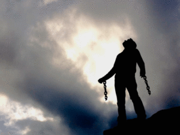

Siempre he pensado que traer hijos al mundo es una gran responsabilidad que no debería ser tomada a la ligera. A lo largo de mi vida compartí mi sentir con mucha gente, amigos, familia, compañeros de trabajo, y si bien, la gran mayoría manifestaba la misma preocupación sobre padres adolescentes, ¡casi ninguno se preocupaba por los adultos que se convertirían en padres…hasta que ya veían los platos rotos y en algunos casos era muy tarde corregir el rumbo!

Este espacio virtual servirá a todos, a los que ya son padres, a los que están por serlo y a los que aún no lo son; por que **las heridas internas del pasado no distinguen estado civil, sexo, clase social, económica, grados académicos o éxito laboral, están presentes en hombres y mujeres,** hasta que uno decide emprender un trabajo interior consciente, personal y único para sanar sus heridas emocionales.

Y esta es la gran diferencia al momento de trasmitir y heredar conocimiento, experiencias, recuerdos, talentos, frustraciones, amor y conciencia, a quienes serán nuestros cómplices y grandes maestros de vida.

Pero ¿Qué pasa si llegamos emocionalmente inmaduros a esta etapa que cambiará completamente nuestras vidas? ¿Cuánto dolor, cicatrices emocionales y frustraciones, aun sin quererlo, les transmitirían a sus hijos? ¿Qué será de estos seres puros, recipientes limpios, herederos y detonadores de los más grandes anhelos, miedos, sueños, esperanzas, alegrías y preocupaciones?

Busquemos sanar nuestra experiencia de vida, trascender con emociones inteligentes libres de miedos, heredar sin encadenar, transmitir con pasión y no con temor, comunicar abriendo puertas y tocando corazones, de manera clara, sana, objetiva y con inteligencia emocional hasta convertirnos en seres humanos integrales, madres y padres, guías amorosos y respetuosos guardianes de las emociones y recuerdos de nuestros descendientes. Sanemos nuestro linaje.

Nos vemos en el siguiente post!

Haz una ligera instrospeccion y piensa cuales son las heridad que te gustaria sanar. O cuales son las actitudes, conocimientos, o situaciones que no te gustaria heredar a tus hijos.

Recuerda que lo mas importante que estas haciendo ahora, es amarte. Asi que hazlo con cariño, paciencia, sin juicios y tratare como tratarias a un niño pequeño.
